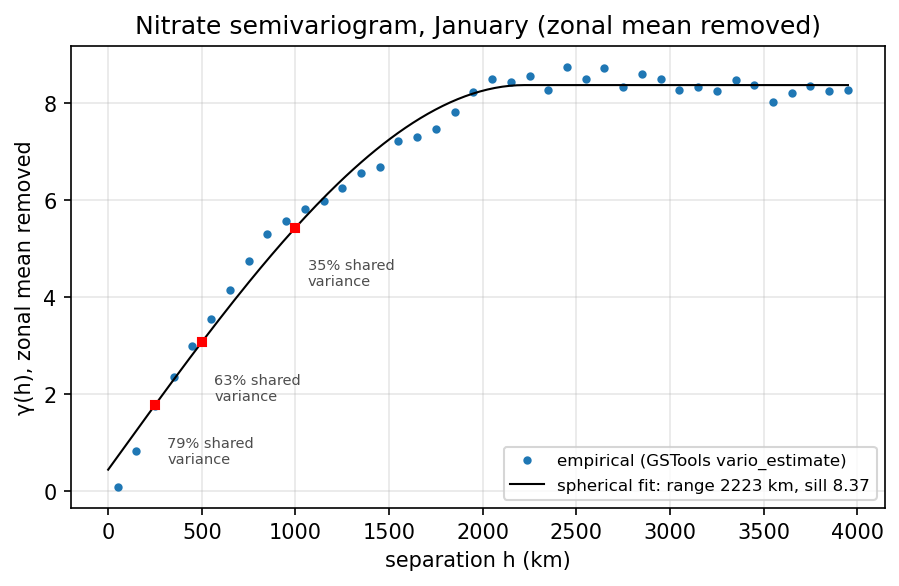
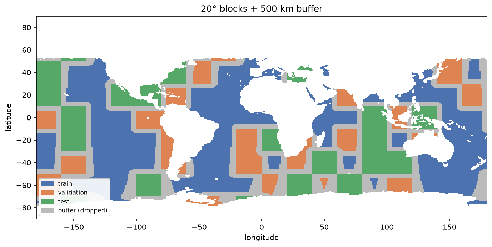
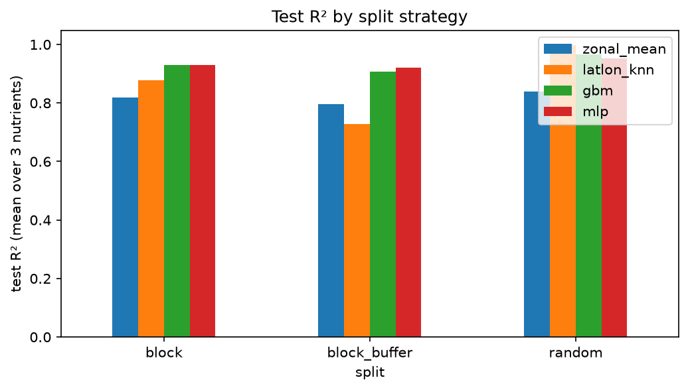

<a id="readme-top"></a>

<div align="center">

# modis-nutrients

**Predicting surface nitrate, phosphate, and silicate from Aqua MODIS with spatially aware validation.**


</div>

## Overview

This project uses seven Aqua MODIS surface products to predict three surface nutrients from the World Ocean Atlas 2013 (WOA13): **nitrate, phosphate, and silicate**.

The main question is not only whether a model can fit the nutrient fields, but whether it can **generalize to geographically unseen regions**. Both the MODIS climatologies and WOA13 nutrient fields are spatially smooth, so a random pixel split can reward interpolation between neighboring cells. The workflow therefore compares random validation with spatial blocks and a geographic buffer, and includes location-only baselines to quantify how much apparent skill can come from the map itself.

The default experiment uses January climatology on a common 1° grid, with **33,412 usable ocean cells**.

---

## Data

| Role | Source | Variables | Native / analysis grid |
|---|---|---|---|
| Predictors | Aqua MODIS Level-3 monthly climatology | CHL, APH, FLU, PIC, POC, PAR, SST | ~9 km → 1° |
| Targets | World Ocean Atlas 2013 v2 | nitrate, phosphate, silicate | 1° |

MODIS is finer than WOA13, so the satellite products are aggregated onto the 1° WOA grid before the ML dataset is built. Selected positive, strongly skewed ocean-color variables are aggregated in log space; cells without sufficient valid satellite coverage remain missing.

Rows with missing nutrient targets are excluded. Targets are never imputed.

---

## Evaluation design

Spatial autocorrelation is the main evaluation issue in this dataset. An empirical semivariogram of the latitude-detrended nitrate field (GSTools, great-circle distances, spherical fit) gives a residual correlation scale of roughly **2,200 km**; two cells 200 km apart still share about 80 % of their residual variance (63 % at 500 km), so adjacent grid cells are far from independent.

<p align="center"></p>

The project compares three split strategies:

- **Random 60/20/20** — standard random train / validation / test split (`KFold`, five shuffled folds: one test, one validation, three training).
- **20° spatial blocks** — whole geographic tiles are assigned to one partition with scikit-learn's `StratifiedGroupKFold` (tile = group, latitude row = stratum; one fold test, one validation, three training), so every latitude band is present in all three partitions.
- **20° blocks + 500 km buffer** — whole-block assignment plus removal of training samples within 500 km of validation/test regions; validation samples within 500 km of test are also removed. The test set is kept fixed.

The 500 km buffer is a practical way to reduce the strongest local leakage; it is not intended to make geophysical samples fully independent.

<p align="center"></p>

All learned preprocessing is fitted on the **training partition only**. Validation and test data only use the already fitted transformations.

---

## Models and baselines

Four models are evaluated under the same split strategies:

| Model | Inputs | Purpose |
|---|---|---|
| `zonal_mean` | latitude | Broad latitudinal-climatology baseline |
| `latlon_knn` | latitude + longitude | Location-only local interpolation baseline |
| `gbm` | seven MODIS predictors | Gradient-boosted tree model for tabular regression |
| `mlp` | seven MODIS predictors | TensorFlow MLP, 7 → 64 → 32 → 3 |

The two feature models do **not** use latitude or longitude.

### Headline results

Test R², averaged over nitrate, phosphate, and silicate:

| Split | Zonal mean | Lat/lon kNN | GBM | MLP |
|---|---:|---:|---:|---:|
| Random | 0.838 | **0.998** | 0.966 | 0.952 |
| 20° blocks | 0.818 | 0.877 | **0.930** | 0.929 |
| 20° blocks + 500 km buffer | 0.797 | 0.727 | 0.907 | **0.921** |

<p align="center"></p>

The location-only kNN is nearly perfect under the random split and outperforms both feature models. Once nearby training information is removed, its R² falls to about 0.73, below the zonal-mean baseline, while GBM and MLP remain around 0.91–0.92. This indicates that random splitting strongly rewards spatial interpolation, while the MODIS feature models retain useful predictive information in unseen regions.

The blocked numbers depend on which tiles land in the test set: re-running with another `split.seed` moves them by a few hundredths of R², while the random split is insensitive to the seed. Seed 42 is reported above.

---

## Which inputs carry the signal?

To separate model choice from feature choice, the same GBM is retrained with different predictor sets:

| Inputs | Random | 20° blocks + 500 km buffer |
|---|---:|---:|
| SST only | 0.896 | 0.874 |
| SST + PAR | 0.929 | 0.890 |
| Ocean color only (CHL, APH, FLU, PIC, POC) | 0.833 | 0.681 |
| All seven | **0.966** | **0.907** |

SST alone retains most of the spatially held-out predictive skill in January: the ocean-color products add 0.03 R² on top of SST under the buffered split, half of what they appear to add under the random split, and the ocean-color-only model loses far more between the two splits than the SST-only model. The MLP shows the same pattern (0.878 → 0.921 from SST only to all seven under the buffered split). At this 1° climatological scale, SST captures much of the large-scale upper-ocean regime associated with nutrient structure; this does **not** imply that ocean color is uninformative at native resolution or for temporal anomalies.

---

## SHAP explainability

The project uses SHAP on spatially held-out test cells to examine what the trained models rely on.

The GBM uses `shap.TreeExplainer`; the MLP uses the model-agnostic permutation explainer. Mean absolute SHAP values summarize the local attributions across the held-out cells. SST ranks first for all three nutrients in both models; for nitrate its mean |SHAP| is about **7.4 µmol kg⁻¹** (GBM) and **7.0** (MLP), while each other MODIS input is below **0.5** (GBM) and **1.3** (MLP).

This agrees with the independent feature-ablation experiment: SST carries most of the generalizable signal in the January 1° climatology.

SHAP values describe model attribution, not causality.

---

## Preprocessing

The ML preprocessing is implemented with scikit-learn `Pipeline` / `ColumnTransformer`:

- `CHL`, `APH`, `PIC`, `POC`: `log10` → median-imputation step → standardization
- `FLU`, `PAR`, `SST`: median-imputation step → standardization
- nitrate, phosphate, silicate: standardized for model fitting and mapped back to physical units for evaluation

The default January dataset requires all seven predictors to be present, so predictor imputation mainly serves as a safeguard for other configurations. All fitted preprocessing statistics come from training data only.

---

## Workflow

```text
Aqua MODIS (~9 km)        WOA13 nutrients (1°)
        │                         │
        └────── regrid / align ───┘
                     │
              common 1° table
                     │
           spatial train/val/test
                     │
             ML preprocessing
                     │
          baselines + GBM + MLP
                     │
       evaluation / ablation / SHAP
```

All results come from `notebooks/02_results.ipynb`, which calls the package and writes the figures in this README to `docs/figures/`: data, spatial correlation and split, model comparison, feature ablation, prediction maps, SHAP, a July check, and hyperparameter tuning.

---

## Repository layout

```text
configs/
  default.yaml                 default January experiment
  all_months.yaml              multi-month configuration

src/modis_nutrients/
  download.py                  MODIS / WOA download helpers
  regrid.py                    MODIS → 1° aggregation and WOA alignment
  dataset.py                   netCDF → analysis table
  spatial.py                   spatial blocks, buffer, GroupKFold helpers, GSTools variogram
  features.py                  log / impute / standardize preprocessing
  models.py                    baselines, GBM, TensorFlow MLP
  evaluate.py                  metrics, model comparison, ablation
  tuning.py                    Optuna search scored by blocked GroupKFold
  explain.py                   SHAP explanations
  plotting.py                  figures
  cli.py                       `download` and `build` commands

notebooks/
  00_download_and_build.ipynb
  01_data_and_eda.ipynb
  02_results.ipynb             all results

tests/                         split, preprocessing, regridding, tuning tests
aws/                           optional SageMaker training / tuning launchers
docs/figures/                  README figures
```

---

## Quick start

Python 3.10+ is recommended.

```bash
git clone <repository-url>
cd modis-nutrients
pip install -e ".[dev,keras]"
pytest -q
```

Open the results notebook (about 30 minutes on a laptop CPU to re-run from a clean kernel):

```bash
jupyter notebook notebooks/02_results.ipynb
```

The default config uses:

```text
data/satellite_and_WOA13_1deg_monthly.nc
```

Raw source files are not required to reproduce the included analysis table. To rebuild the dataset from source products, use the `download` and `build` commands; MODIS access requires NASA Earthdata credentials.

---

## Hyperparameter tuning

Hyperparameter tuning is optional and is kept separate from the final test evaluation. Candidate settings are scored only inside the outer training partition using `GroupKFold` with spatial block IDs as groups.

Candidates are proposed by Optuna (`tuning.tune_optuna`, search spaces defined in `tuning.py`, section 8 of the notebook) and, optionally, by SageMaker Automatic Model Tuning with the same scoring function. The best trials differ by a few thousandths of R², less than the fold-to-fold spread, and the tuned test scores match the defaults, so hyperparameter choice is not the main driver of the conclusions.

---

## AWS SageMaker

The results notebook can be executed as a SageMaker script-mode training job: `aws/train_entry.py` stages the data from S3, runs the notebook with nbconvert, and uploads the executed notebook and figures with the job. `aws/run_tuning.py` launches SageMaker Automatic Model Tuning against the same blocked-CV objective.

```bash
python aws/run_sagemaker.py \
  --bucket <bucket> \
  --role <SageMakerExecutionRoleArn> \
  --experiment modis-nutrients \
  --wait
```

AWS is optional; all core results can be reproduced locally.

---

## Limitations and next steps

- The headline analysis is **January-only**. July behaves differently (section 7 of the notebook): with the Southern Ocean in polar night the nutrient variance is much smaller, blocked R² is lower at a similar absolute error, and ocean color adds more on top of SST. A full-year evaluation needs a split that blocks space and time together.
- Blocked scores vary by a few hundredths of R² across block assignments (`split.seed`); a headline number should be read with that in mind.
- WOA13 treats inland seas (e.g. the Caspian) as ocean; they are the largest January outliers and should be masked.
- WOA13 objectively analyzed climatologies are spatially smoothed targets; an in-situ matchup with GLODAP, GO-SHIP, or BGC-Argo would provide a more direct test against observations.
- The current 1° climatological framing removes much of the native spatial and temporal structure of the MODIS products. Higher-resolution or anomaly-based experiments may change the importance of ocean-color predictors.
- A leave-one-basin-out experiment would provide a stronger test of geographic extrapolation.
- WOA observation-count / uncertainty fields can be incorporated into weighting or target-quality screening.

---

## References

- Garcia, H. E., et al. (2014). *World Ocean Atlas 2013, Volume 4: Dissolved Inorganic Nutrients (phosphate, nitrate, silicate).* NOAA Atlas NESDIS 76.
- NASA Goddard Space Flight Center, Ocean Ecology Laboratory, Ocean Biology Processing Group. *Moderate-resolution Imaging Spectroradiometer (MODIS) Aqua Ocean Color Data.* NASA OB.DAAC.
- Roberts, D. R., et al. (2017). Cross-validation strategies for data with temporal, spatial, hierarchical, or phylogenetic structure. *Ecography*, 40, 913–929.
- Ploton, P., et al. (2020). Spatial validation reveals poor predictive performance of large-scale ecological mapping models. *Nature Communications*, 11, 4540.
- Meyer, H., et al. (2019). Importance of spatial predictor variable selection in machine learning applications – moving from data reproduction to spatial prediction. *Ecological Modelling*, 411, 108815.

## License

MIT. See `LICENSE`.

## Acknowledgments

An earlier prototype of the MODIS–nutrient prediction workflow was developed with Parker Lawrence during the NSF CyberTraining workshop in Wilmington, NC (May 2024).
